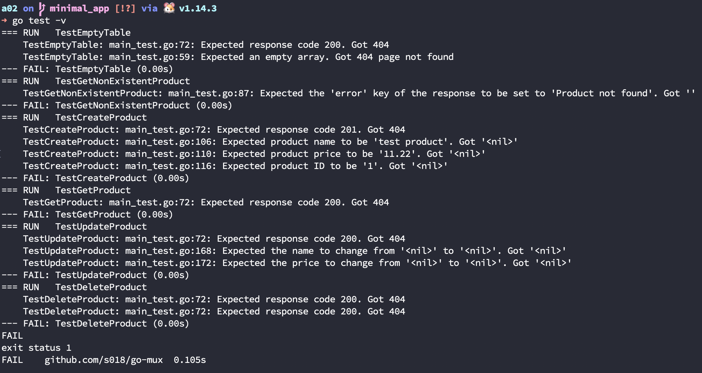
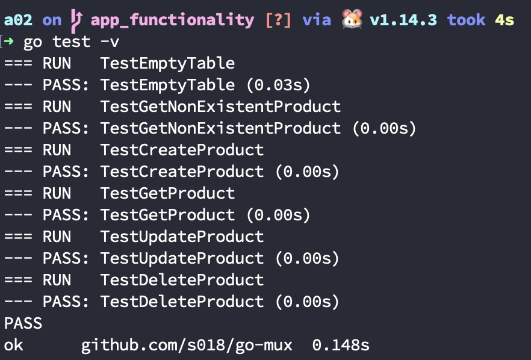
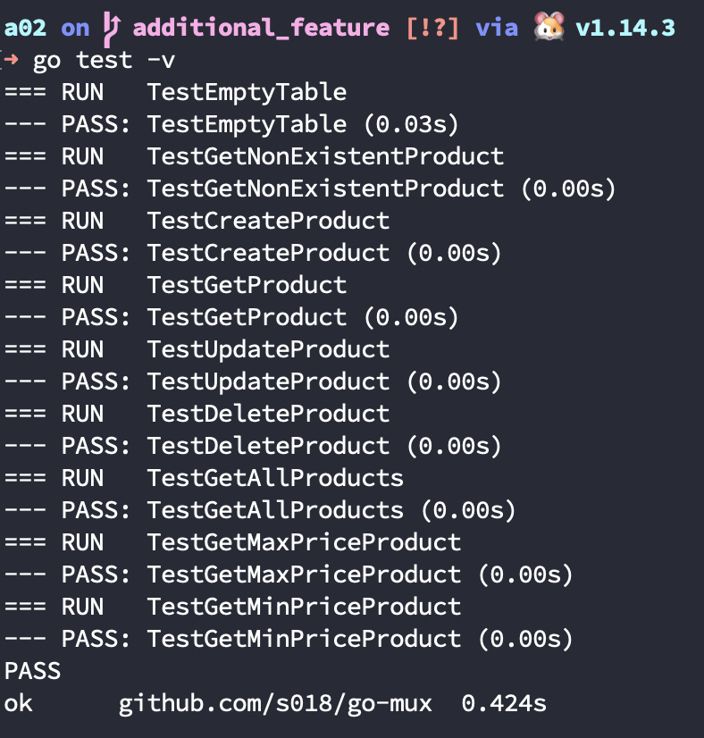
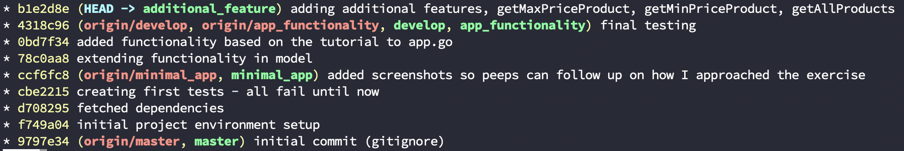

# Assignment 02 - Microservice with Go and PostGreSQL

## Initial project setup 
- execute `chmod +x init.sh` in this folder
- execute `./init.sh` to get your Go- and PostgreSQL-environment up and running



## Database Setup
- you only have to export the variables below
- The database setup is already done with the `init.sh`

```bash
export APP_DB_USERNAME=postgres
export APP_DB_PASSWORD=postgres
export APP_DB_NAME=postgres
```

## App Functionality
Following the tutorial I ended up with a working ProductService (App).



## Additional Features
As stated in the assignment description new features are added at this point.

- `getAllProducts` to get all products at once (without any further parameters), including a corresponding test case
- `getMaxPriceProduct` get product with the highest price, including a corresponding test case
- `getMinPriceProduct` get product with the lowest price, including a corresponding test case



## Personal Notes/Lesson learnt
I wasn't able to implement the `getMaxPriceProduct` and the `getMinPriceProduct` functions as "global" functions - still couldn't figure out why it didn't work out. I was able to implement them as type-specific-methods.

Go is a very handy programming language, but I find it hard for myself to get used to it - maybe because I am more common to Kotlin and feel at more at home with the Spring environment. Nevertheless this was an exciting exercise!

## Resulting Branches/Commits

