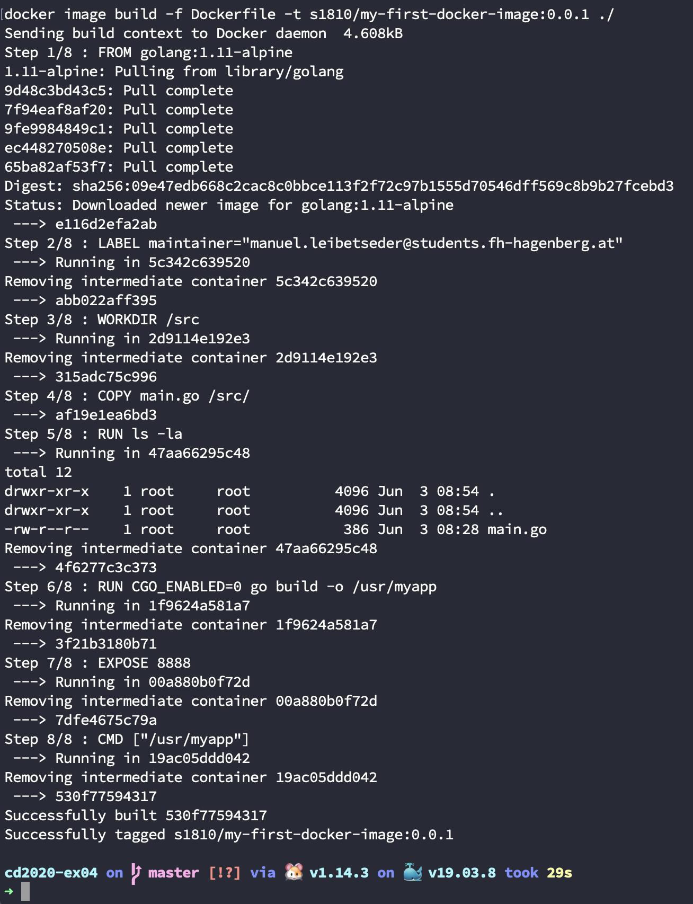
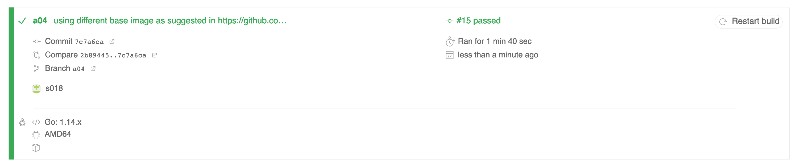

# Assignment 03
## S1810455012, Manuel Leibetseder

### Prerequisites

- [x] Docker installation
- [x] DockerHub account registration

### Part 1

#### ACK `main.go` run

#### ACK CURL

#### ACK Tests Run

#### Dockerfile Modifications
Modifications as pointed out in the Dockerfile itself can be found [here](Dockerfile).

#### Build Image
Building the image with:

`docker image build -f Dockerfile -t s1810/my-first-docker-image:0.0.1 ./`

 

#### Docker Images
Current images available on my machine:

#### DockerHub Login

#### DockerHub Push

### Part 2
#### Docker Run & Stop

### Part 3
#### Dockerfile and .travis.yml Adaption
Using Travis CI to automatically build the image of the exercise. The Dockerfile and .travis-yml had to be adapted to make it work fully automatically.

#### Pulling the Images
In order to verify the images were pushed to the DockerHub-repository a pull has been done:

#### Run the Containers
Verifying working containers:

