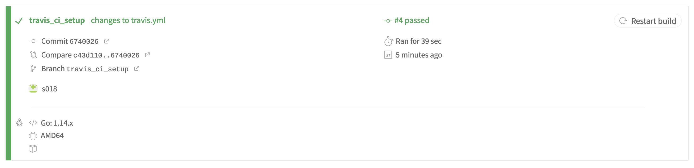

# Exercise 03 - Travis CI [](https://travis-ci.com/s018/go-mux)

## Changes
The changes came up with the database. Beforehand `brew` was used to init and create the database. For this exercise the database was switched to a docker deployment.

## Travis CI
The Travis CI build was initiated as soon as the first commit was done (just committing and pushing the [travis.yml](.travis.yml)). I noticed the build couldn't get through because there are no credentials exported by the yml-script. Therefore the build fails as one can see in the [build log](build.log). One can also take a look via Travis website [here](https://travis-ci.com/github/s018/go-mux) as the project is on open source state anyways.


## Solution
The solution one can think of (as we did on local environment) add the global variables to the Travis-file.

```YAML
env:
  global:
    - APP_DB_USERNAME=postgres
    - APP_DB_PASSWORD=
    - APP_DB_NAME=postgres
```

One could also go with fixed credentials in the [main_test.go](main_test.go) file:

```go
a.Initialize(
    "postgres", //os.Getenv("APP_DB_USERNAME"),
    "",         //os.Getenv("APP_DB_PASSWORD"),
    "postgres" //os.Getenv("APP_DB_NAME"))
)
```

Since this approach isn't the most promising, better export standard credentials in the Travis-yml, as this gives developers the opportunity to use own credentials. After this change the Travis build exits with a success message as seen below
